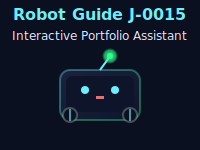

<h2 align="center">Interactive Robotics Portfolio</h2>

An interactive, robotics‑themed portfolio site featuring a canvas‑rendered robot guide that performs real‑time A* path planning, follows your cursor/touch, and avoids obstacles ( from the live DOM layout ). 

### Demo
- [Visit my portfolio](https://vasu-sutariya.github.io/vatsal-sutariya/) or Open `index.html` locally in a browser, or host the folder on any static server.

### Features
- **Real‑time path planning**: A* on a grid with line‑of‑sight shortcutting and Chaikin smoothing. 
- **Dynamic obstacle map**: Obstacles are rebuilt from page content (headings, text, buttons, images), so the robot navigates around actual layout.
- **Contextual dialogue**: Short hints that trigger near sections like Skills, Projects, Academic Projects and Contact.

### Controls & interaction
- Move your mouse or tap/drag on touch devices: the robot plans a path and follows the target while avoiding page content.
- The compass arrow in the "Interactive Portfolio Webpage" project points toward the robot.

## Path Planning and Following

The robot uses multi-stage path planning and execution system:

#### 1. Grid-Based A* Pathfinding
- **Grid Representation**: The world is discretized into a 24×24 pixel grid where each cell is either free (0) or occupied (1)
- **Heuristic Function**: Manhattan distance for admissible heuristic
  ```
  h(a,b) = |aₓ - bₓ| + |aᵧ - bᵧ|
  ```
- **Cost Function**: Uniform cost of 1 per grid cell movement
- **Neighborhood**: 4-connected (up, down, left, right) for computational efficiency

#### 2. Path Smoothing Pipeline
**Line-of-Sight Shortcutting**:
- Iteratively removes unnecessary waypoints by checking direct visibility
- Uses ray-marching with step size of `cellSize/2` for collision detection
- Reduces path length while maintaining obstacle avoidance

**Chaikin Smoothing**:
- Applies one iteration of Chaikin's corner-cutting algorithm
- For each pair of consecutive points (p₀, p₁), creates two new points:
  ```
  q = 0.25 × p₀ + 0.75 × p₁
  r = 0.75 × p₀ + 0.25 × p₁
  ```
- Results in smoother, more natural robot motion

#### 3. Motion Control System
**Arrival Steering**:
- Uses proportional control with arrival radius for smooth deceleration
- Desired velocity calculation:
  ```
  v_desired = min(v_max, distance_to_target / slow_radius) × unit_vector_to_target
  ```
- Slow radius: 100 pixels for gradual deceleration

**Acceleration Control**:
- Implements acceleration-limited steering
- Steering force: `F = v_desired - v_current`
- Clamped to maximum acceleration: `|F| ≤ a_max`
- Integration: `v(t+dt) = v(t) + F × dt`

**Collision Resolution**:
- Circle-rectangle collision detection with penetration depth
- Push-out force: `F_push = (radius - penetration) × normal_vector`
- Velocity cancellation: `v_new = v_old - (v_old · normal) × normal`

#### 4. Real-time Adaptation
- **Dynamic Obstacle Mapping**: Rebuilds obstacle grid from DOM elements every 100ms during scroll
- **Replanning**: A* executed every 80ms for moving targets
- **Path Following**: Robot follows smoothed waypoints with look-ahead for continuous motion

#### 5. Performance Optimizations
- **Grid Caching**: Obstacle grid rebuilt only when layout changes
- **Path Caching**: Smooth path points computed once per A* solution
- **Throttled Updates**: Motion and planning updates limited to prevent frame drops

### Configuration (in `main.js`)
- **Grid cell size**: `const cellSize = 24;`
- **Robot motion limits**: `robot.maxSpeed`, `robot.maxAccel`, `robot.radius`.
- **Initial pause**: `robot.freezeTimer` is set in `positionRobotAtHero()`.
- **Replan cadence**: `planIntervalMs` (lower = more responsive, higher = fewer computations).
- **Obstacle sources**: CSS selector list in `rebuildObstaclesFromDOM()`.

Adjust these values to tune performance and feel. Smaller `cellSize` yields finer navigation but higher CPU usage.

### Robot Design

The robot guide features a sleek, minimalist design with smooth animations:



**Features**:
- **HELLA CUTE**
- **Body**: Rounded rectangle with gradient border
- **Face Panel**: Dark panel with cyan eyes and red status indicator
- **Antenna**: Animated LED that pulses with robot's movement
- **Wheels**: Static circular wheels with spoke design
- **Animations**: Gentle bobbing motion, blinking eyes, and smooth steering

